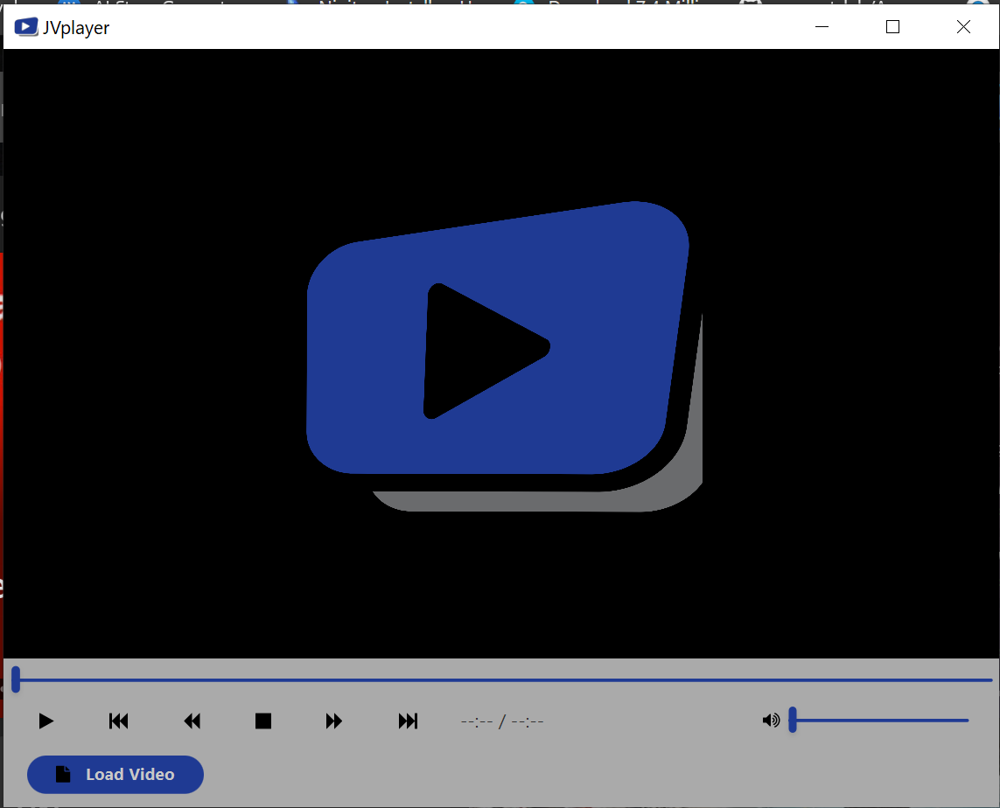
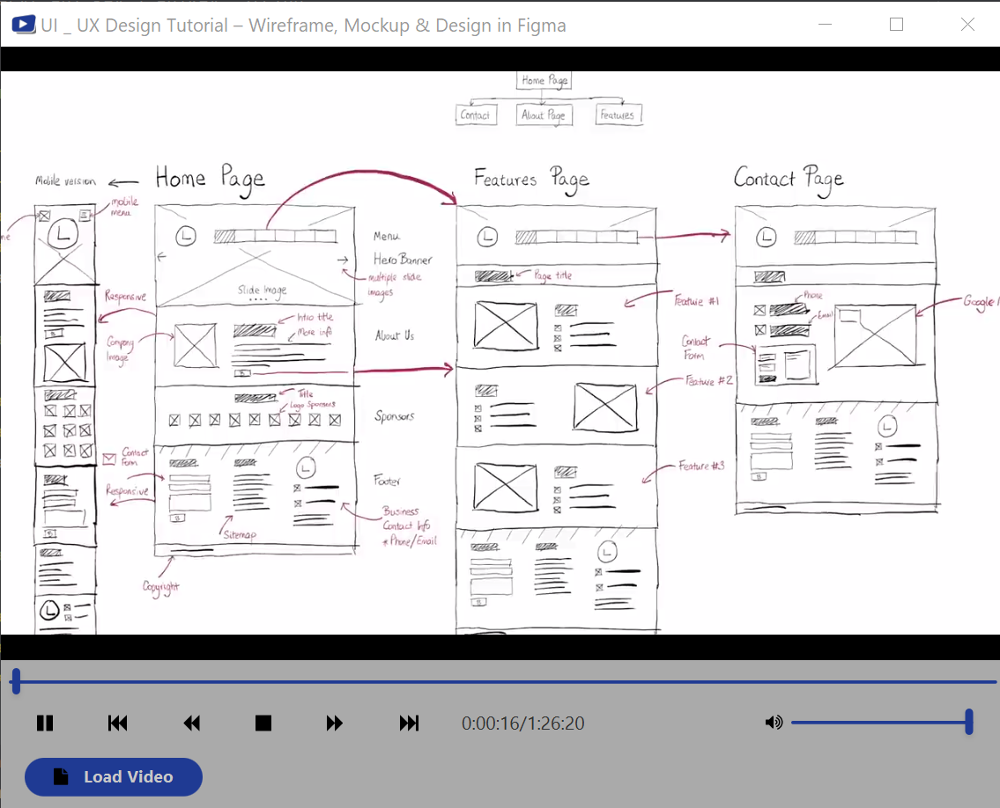

# JPlayer - A JavaFX Video Player Desktop Application

## Overview
JPlayer is a desktop video player application built using JavaFX, designed to provide an intuitive and user-friendly interface for playing video content. This open-source project aims to offer essential media player controls and features, making it a valuable addition to your desktop applications.

## Features
- **Media Playback**: JPlayer supports various video formats and allows you to play your favorite videos seamlessly.
- **Play/Pause**: Control video playback with a simple play/pause button.
- **Volume Control**: Adjust the volume with a dedicated slider and dynamic volume icon updates.
- **Timeline Control**: Easily seek to different parts of the video with a progress slider.
- **Full-Screen Mode**: Enjoy videos in full-screen mode for an immersive viewing experience.
- **History**: Keep track of your recently played videos with a history feature.
- **Skip Forward/Backward**: Quickly navigate within the video with skip forward and backward buttons.
- **Customization**: You can extend and customize the application to fit your specific needs.

## Screenshots

## Getting Started
Follow these steps to get started with JPlayer:

1. **Clone the Repository**: Clone this GitHub repository to your local machine.

2. **Build and Run**: Open the project in your favorite Java IDE, build it, and run the application.

3. **Load a Video**: Click the "Load Video" button to select a video file from your local system.

4. **Play and Enjoy**: Use the play/pause button, volume slider, and other controls to enjoy your videos.

## Requirements
To run JPlayer, you need:

- [Java Development Kit (JDK)](https://www.oracle.com/java/technologies/javase-downloads.html) 11 or higher.
- JavaFX library.

## Contributing
We welcome contributions to make JPlayer even better! If you'd like to contribute, please follow our [contribution guidelines](CONTRIBUTING.md).

## License
JPlayer is open-source software released under the [MIT License](LICENSE). Feel free to use and modify it according to your needs.

## Support
If you encounter any issues or have questions, please [open an issue](https://github.com/JamesHardey/JPlayer/issues). We're here to help!

## Acknowledgments
We'd like to thank the Java and JavaFX communities for their support and contributions to this project.

## Author
- Your Name
- GitHub: [JamesHardey](https://github.com/JamesHardey)

## Disclaimer
This application is for educational and personal use. Please ensure you have the necessary rights or permissions to play the videos you select.

Enjoy your media playback with JPlayer!

